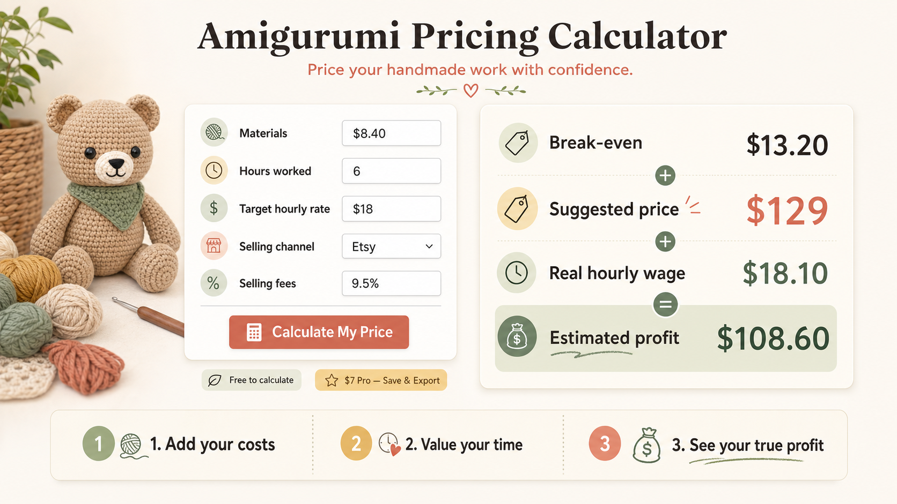

# 方向验证第 3 轮：定价计算器词群

> 日期：2026-07-22  
> 目标：为第一个轻量工具站寻找不依赖平台 API、用户可触达、可用极小页面验证的稳定词群。  
> 结论：**主候选 `crochet pricing calculator`，产品切口收窄为 `amigurumi pricing calculator`；尚未进入重开发。**

## 0. 本轮验证合同

- 截止：本轮对话结束，不继续横向扩词。
- 现金预算：纸面研究 `$0`。
- 候选上限：25 条种子、5 个词群，只深查 3 个。
- 成功条件：需求与意图有真实搜索/讨论证据；SERP 不是强 SaaS 一统；已有商业行为；无需 API 即可交付；有合规触达入口。
- 停止条件：泛词被强 SaaS/大量同质工具占满；没有搜索簇；必须先做完整 CRM、平台集成或移动 App。
- 本轮必须决定：留下 1 个主候选和最多 1 个观察位。

## 1. Seed Pool（25 条）

以下词来自 2026-07-22 Google autocomplete 的真实返回，并用 SERP、社区帖子或竞品页复核；没有返回建议的 AI 扩写词未计入核心种子。

### A. 清洁服务报价（6）

`cleaning bid calculator`、`commercial cleaning bid calculator`、`free cleaning bid calculator`、`free commercial cleaning bid calculator`、`house cleaning bid calculator`、`residential cleaning bid calculator`

### B. Crochet / Amigurumi 定价（8）

`crochet pricing calculator`、`crochet pricing calculator free`、`crochet pricing calculator online`、`crochet product pricing calculator`、`pricing crochet items calculator`、`crochet profit calculator`、`amigurumi pricing calculator`、`crochet commission calculator`

### C. Home bakery / Cookie 定价（4）

`home bakery pricing calculator`、`cookie pricing calculator`、`cookie pricing calculator free`、`sugar cookie pricing calculator`

### D. Maker 成本计算（4）

`embroidery pricing calculator`、`machine embroidery pricing calculator`、`sublimation pricing calculator`、`cricut pricing calculator`

### E. 平台卖家利润（3）

`whatnot profit calculator`、`whatnot profit calculator uk`、`airbnb cleaning fee calculator`

## 2. 词群 → 用户任务 → 站型 → 第一变现

| 词群 | 用户任务 | 最小站型 | 第一变现假设 |
|---|---|---|---|
| 清洁服务 bid calculator | 在报价前算人工、耗材、频率、利润 | 可配置计算器/报价表单 | 嵌入组件一次性购买或月费 |
| Crochet / Amigurumi pricing | 把毛线、填充物、工时、平台费换成售价与真实时薪 | 免费交互计算器 | 一次性 Pro 导出；毛线/工具联盟；后续广告 |
| Home bakery / Cookie pricing | 把配方、包装、工时、损耗换成单件售价 | 配方成本计算器 | 表格/Pro 保存；烘焙联盟 |
| Embroidery pricing | 按针数、服装、工时、批量折扣报价 | 计算器 + DST/图片输入 | Pro 报价与订单管理 |
| Whatnot profit | 在开播/起拍前算平台费、COGS 与最低价 | 费率/利润计算器 | 交叉销售卖家 SaaS/联盟 |

## 3. 深查结论

### 3.1 `cleaning bid calculator` — reject 泛词，保留问题洞察

- **需求 pass**：Google autocomplete 形成 commercial/free/house/residential 查询簇；近期经营者仍在寻找远程报价方法。
- **商业 pass**：清洁报价组件已有一次性约 AU$66 的数字下载；QuoteKit 等产品以约 £29/月销售嵌入式报价和 lead capture。
- **竞争 fail**：SERP 已有 Housecall Pro、Connecteam、Method Clean、CleanGuru 等强域名和垂直软件；Method Clean 声称其工具十年内服务超过 17 万名清洁从业者。
- **窄痛点**：近期帖子指出，客户只清部分房间时，按平方英尺计算失真；按房间、状态和预估工时更合适。但 `room-by-room cleaning quote` 与 `partial house cleaning estimate` 未形成 autocomplete 词群。

结论：这是可做销售 SaaS 的问题，但不是当前最合适的 SEO 主词；若未来有清洁公司愿意共同设计，可作为访谈驱动方向重新激活。

证据：[近期真实报价问题](https://www.reddit.com/r/cleaningbusiness/comments/1sy2tna/i_need_help_with_quote_calculator/)、[Housecall Pro 免费计算器](https://www.housecallpro.com/home-cleaning/templates-calculators/home-cleaning-bid-calculator/)、[Method Clean 商业清洁计算器](https://methodcleanbiz.com/janitorial-bid-calculator/)、[QuoteKit 定价](https://quotekit.nexadesign.io/cleaning-quote-calculator)。

### 3.2 `cookie pricing calculator` — reject 泛词

- **需求 pass**：autocomplete 有 free 与 sugar cookie 等变体。
- **商业 pass**：Etsy 上同类表格常见价格约 `$2–25`，部分 listing 已有数百至数千条评价。
- **竞争 fail**：SERP 同时有 BakeProfit、CakeCost、独立计算器和大量 Etsy 模板；“材料 + 工时 + overhead + margin”没有差异。
- **工程低**，但低工程并不能抵消同质化。

结论：不做又一个配方/饼干表格。只有“收据自动更新原料价格”可能形成差异，但会增加 OCR、商品匹配和持续校准，不适合第一站。

证据：[Etsy cookie pricing 市场](https://www.etsy.com/market/cookie_pricing_calculator)、[BakeProfit 免费工具](https://bakeprofit.com/tools/recipe-cost-calculator)、[CakeCost](https://www.cakecost.net/)。

### 3.3 `crochet pricing calculator` → `amigurumi pricing calculator` — narrow，主候选

- **需求 pass**：autocomplete 有 free、online、product、profit、commission、地区版本等查询簇；`amigurumi pricing calculator` 也独立出现。
- **意图 pass**：SERP 以计算器、Google Sheet、定价教程和 Etsy 数字商品为主，符合工具页面。
- **商业 pass**：Etsy 的 amigurumi 定价表价格常见约 `$3–10`；多个产品有数百条评价，其中一个结果显示 800+ 评价，证明有人为“定价方法/工具”实际付款。
- **竞争 unsettled**：已有 American Crochet Association、博客免费计算器、AeternaCraft、KitCrochet 和 Etsy 表格，但结果分散，尚未看到一个强 SaaS 垄断。
- **承接 pass（窄切口）**：不只输出“材料 + 时间”；为 amigurumi 卖家同时输出：break-even、目标时薪售价、当前市场售价下的真实时薪、Etsy/craft fair 费用、批量/commission 报价，并允许本地保存/导出。
- **触达 pass**：Facebook 有持续的定价问答与工具讨论；Reddit 有 `r/Amigurumi`、`r/crochet` 等公开社区。发布或招募仍需逐一检查版规，不把点赞当验证。
- **工程 pass**：第一版纯前端、本地计算，无账号、数据库、API、隐私订单数据或 App。
- **流量 unsettled**：autocomplete 证明有查询，但 Google Trends 本轮返回 429，月搜和趋势仍未知，不能伪造量级。

主词与切口：

```text
SEO 主词：crochet pricing calculator
首个工具页：amigurumi pricing calculator
一句话承接：See the price, break-even point, and real hourly wage for an amigurumi project after materials, selling fees, and labor.
```

证据：[Etsy amigurumi pricing 市场](https://www.etsy.com/market/amigurumi_pricing_calculator)、[已有购买评价的商品页](https://www.etsy.com/listing/1823193146/amigurumi-market-pricing-profit)、[免费 crochet 计算器](https://vivcrochets.com/crochet-calculators/)、[AeternaCraft 工具簇](https://aeternacraft.com/tools/)、[Facebook 的 App 需求问题](https://www.facebook.com/groups/578610593251706/posts/1117140112732082/)。

## 4. 其他候选的快速处理

- `whatnot profit calculator`：**reject**。2026 SERP 已有 SellerFeeCalc、Zik Analytics、独立 WhatnotFeeCalculator、Aftershows、LiveSellerOS 等多套完整工具；Whatnot 官方也已展示单笔净收入。
- `embroidery pricing calculator`：**watch**。词群明确，但 2026 已有 StitchOps、EmbroideryIQ、Embric App 等带图片/针数读取的工具；简单计算器没有切口。
- `3d printing price calculator`：**park**。autocomplete 最丰富，但 Prusa、Bambu/材料/树脂等结果成熟，且需要更多设备和材料知识，本轮不深挖。

## 5. 最小失败实验（用户选择候选后才执行）

不先做完整产品，只做一页英文承接：标题、4 个输入示例、一个结果卡截图、真实价格和行动按钮。

- 承接物：`Amigurumi Pricing Calculator` 概念页；显示材料 `$8`、6 小时、平台费后，在不同售价下真实时薪是多少。
- 第一报价：免费即时计算；`$7` 一次性 Pro（保存项目、PDF/报价导出、Etsy/craft fair fee presets）。价格只是本轮待测假设。
- 合资格流量：一个获准的 Facebook/crochet 社区入口，或经 Kun 批准后的小额兴趣广告；不伪装卖家经历。
- 本项目实验判据：最多 7 天或 100 个合资格访问；若无人输入项目数据、无人留下邮箱/点击购买，`reject`；若至少 3 人提交真实项目参数且至少 1 人点击购买/愿意预付，再做最小可用计算器。
- 明确不做：账号系统、社区、pattern marketplace、库存、订单管理、移动 App。

上述数字是控制投入的项目停止线，不是赫兹通用阈值。

## 6. 本轮结论

1. **主候选：`crochet pricing calculator`，首个窄页 `amigurumi pricing calculator`。**
2. **观察位：`embroidery pricing calculator`，除非找到未被现有图片/针数工具覆盖的更窄任务，否则不推进。**
3. 清洁、cookie、Whatnot 泛词本轮停止；不再为了“多比较几个”继续扩池。

## 7. 用户选择与概念原型（2026-07-22）

Kun 已明确表示愿意服务 crochet/amigurumi 卖家，并愿意用第一个项目学习海外用户需求。人群偏好闸门通过，但这不等于市场验证通过。



原型展示：材料费、工时、目标时薪、销售渠道和平台费输入后，立即显示现金成本、建议售价、真实时薪和预计利润。正式验证稿需把 `Break-even` 拆为“现金成本盈亏线”和“包含人工的完整成本”，避免把卖家的劳动从成本中隐藏。

当前 frontier：合资格 crochet/amigurumi 卖家看到该承接后，是否愿意输入一个真实项目、留下联系方式、点击购买或预付。下一步仍是概念页验证，不是完整产品开发。

## 8. 方向拍板：进入最小销售验证（2026-07-22）

Kun 已拍板选择该方向，不再继续横向找词。本方向状态更新为：**go to validation（允许制作可丢弃 Landing Page，尚未批准完整产品开发）**。

按赫兹《卖空气验证需求》的下一步：

1. 锁定一句话问题、三项卖点和真实价格；
2. 制作一页英文 Landing Page，展示具体输入与结果，不先做账号、后台或完整计算器；
3. 放置真实的 `$7` 一次性 Pro 报价和购买/预订动作；
4. 给一小股合资格 crochet/amigurumi 卖家流量；
5. 在最多 7 天或 100 个合资格访问后，依据真实项目输入、购买点击、预付/付款决定 build / revise / reject。

下一交付物：**Landing Page 验证稿（英文文案 + 修正后的结果卡 + 行动埋点/支付方案 + 流量与停止规则）**。在该验证稿完成前不扩功能。
